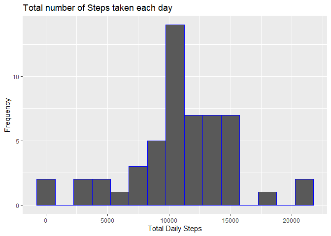
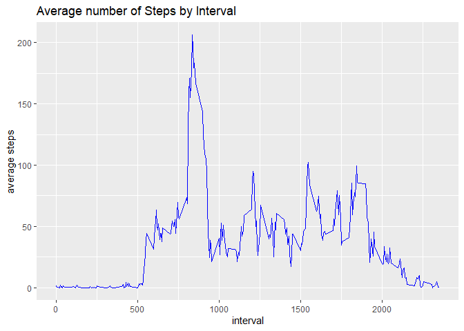
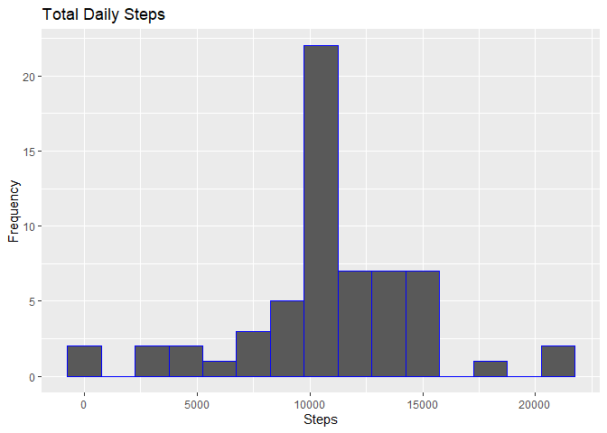
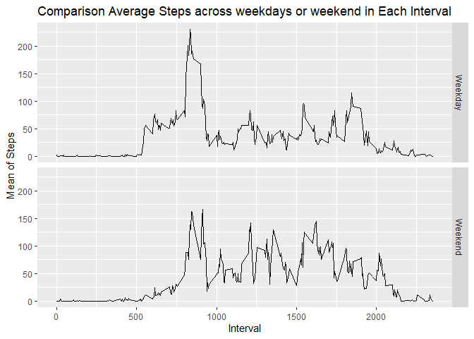

## Loading and preprocessing the data

```r
if(!file.exists('activity.csv')){
    unzip('activity.zip')
}
library(ggplot2)
library(dplyr)
```

```
## 
## Attaching package: 'dplyr'
```

```
## The following objects are masked from 'package:stats':
## 
##     filter, lag
```

```
## The following objects are masked from 'package:base':
## 
##     intersect, setdiff, setequal, union
```

```r
activityData <- read.csv("activity.csv")
# change date type to date class 
activityData$date <- as.Date(as.character(activityData$date))

# create a NA logical vector
activityDataNA <- is.na(activityData$steps)
# create clean data without NA for later calculations
cleanData <- activityData[!activityDataNA,]

#Head of data
head(activityData)
```

```
##   steps       date interval
## 1    NA 2012-10-01        0
## 2    NA 2012-10-01        5
## 3    NA 2012-10-01       10
## 4    NA 2012-10-01       15
## 5    NA 2012-10-01       20
## 6    NA 2012-10-01       25
```

```r
#Data Summary
summary(activityData)
```

```
##      steps             date               interval     
##  Min.   :  0.00   Min.   :2012-10-01   Min.   :   0.0  
##  1st Qu.:  0.00   1st Qu.:2012-10-16   1st Qu.: 588.8  
##  Median :  0.00   Median :2012-10-31   Median :1177.5  
##  Mean   : 37.38   Mean   :2012-10-31   Mean   :1177.5  
##  3rd Qu.: 12.00   3rd Qu.:2012-11-15   3rd Qu.:1766.2  
##  Max.   :806.00   Max.   :2012-11-30   Max.   :2355.0  
##  NA's   :2304
```


## What is mean total number of steps taken per day?
1.Calculate the total number of steps taken per day


```r
#Calculate the total number of steps taken per day
aggregateSteps <- aggregate(activityData$steps, by = list(Date = activityData$date), FUN = sum)
names(aggregateSteps)[1] ="date"
names(aggregateSteps)[2] ="totalSteps"
#First 10 rows of the data containing steps taken per day
head(aggregateSteps)
```

```
##         date totalSteps
## 1 2012-10-01         NA
## 2 2012-10-02        126
## 3 2012-10-03      11352
## 4 2012-10-04      12116
## 5 2012-10-05      13294
## 6 2012-10-06      15420
```

2.Make a histogram of the total number of steps taken each day

```r
# Plot using ggplot
ggplot(aggregateSteps, aes(x = totalSteps)) +
geom_histogram(colour = "blue", binwidth=1500) +
labs(title = "Total number of Steps taken each day", x = "Total Daily Steps", y = "Frequency")
```

```
## Warning: Removed 8 rows containing non-finite values (stat_bin).
```

<!-- -->

3.Calculate and report the **mean** and **median** total number of steps taken per day

```r
# Mean of steps taken per day
print(originalMean <- mean(aggregateSteps$totalSteps,na.rm=TRUE))
```

```
## [1] 10766.19
```

```r
#median of steps taken per day
print(originalMedian <- median(aggregateSteps$totalSteps,na.rm=TRUE))
```

```
## [1] 10765
```

## What is the average daily activity pattern?
1. Make a time series plot (i.e. `type = "l"`) of the 5-minute interval (x-axis) and the average number of steps taken, averaged across all days (y-axis)


```r
meanStepsByInterval <- aggregate(cleanData$steps, by=list(Interval = cleanData$interval),FUN =  mean)
# set the column names
names(meanStepsByInterval)[1] ="interval"
names(meanStepsByInterval)[2] ="steps"

ggplot(meanStepsByInterval, aes(x = interval, y = steps)) +
  geom_line(color="blue")  +         
  labs(title = "Average number of Steps by Interval", x = "interval", y = "average steps")
```

<!-- -->

2. Which 5-minute interval, on average across all the days in the dataset, contains the maximum number of steps?


```r
maxInterval <- meanStepsByInterval[which.max(meanStepsByInterval$steps),]
maxInterval
```

```
##     interval    steps
## 104      835 206.1698
```

## Imputing missing values
1. Calculate and report the total number of missing values in the dataset (i.e. the total number of rows with `NA`s)


```r
#  total number of missing values
totalMissingValues <- sum(activityDataNA)
totalMissingValues
```

```
## [1] 2304
```

2. Devise a strategy for filling in all of the missing values in the dataset. The strategy does not need to be sophisticated. For example, you could use the mean/median for that day, or the mean for that 5-minute interval, etc.

3. Create a new dataset that is equal to the original dataset but with the missing data filled in.


```r
# Create new data set
activityData2 <- activityData
NAdata <- is.na(activityData2$steps)
# fill missing values by calculating the mean for the interval
meanValues <- tapply(cleanData$steps, cleanData$interval, mean, na.rm=TRUE, simplify=TRUE)
activityData2$steps[NAdata] <- meanValues[as.character(activityData2$interval[NAdata])]

# count of NA values in the originaldata 
sum(NAdata)
```

```
## [1] 2304
```

```r
# count of NA values in the new dataset without missing values
sum(is.na(activityData2$steps))
```

```
## [1] 0
```

```r
head(activityData2)
```

```
##       steps       date interval
## 1 1.7169811 2012-10-01        0
## 2 0.3396226 2012-10-01        5
## 3 0.1320755 2012-10-01       10
## 4 0.1509434 2012-10-01       15
## 5 0.0754717 2012-10-01       20
## 6 2.0943396 2012-10-01       25
```


4. Make a histogram of the total number of steps taken each day and Calculate and report the **mean** and **median** total number of steps taken per day. Do these values differ from the estimates from the first part of the assignment? What is the impact of imputing missing data on the estimates of the total daily number of steps?


```r
NewDataSummedByDay <- aggregate(activityData2$steps, by=list(activityData2$date), sum)

names(NewDataSummedByDay)[1] ="date"
names(NewDataSummedByDay)[2] ="totalsteps"
head(NewDataSummedByDay,5)
```

```
##         date totalsteps
## 1 2012-10-01   10766.19
## 2 2012-10-02     126.00
## 3 2012-10-03   11352.00
## 4 2012-10-04   12116.00
## 5 2012-10-05   13294.00
```

```r
# Plot using ggplot
ggplot(NewDataSummedByDay, aes(x = totalsteps)) +
  geom_histogram(colour = "blue", binwidth=1500) +
  labs(title = "Total Daily Steps", x = "Steps", y = "Frequency")
```

<!-- -->

```r
#Calculate and report the **mean** and **median** total number of steps taken per day.  What is the impact of imputing missing data on the estimates of the total daily number of steps?
 
# Mean and Median on New Data
mean(NewDataSummedByDay$totalsteps)
```

```
## [1] 10766.19
```

```r
median(NewDataSummedByDay$totalsteps)
```

```
## [1] 10766.19
```

```r
#Original Mean and Media
originalMean
```

```
## [1] 10766.19
```

```r
originalMedian
```

```
## [1] 10765
```

Do these values differ from the estimates from the first part of the assignment?What is the impact of imputing missing data on the estimates of the total daily number of steps?
As per the values printed above new values differ from the original as the mean is the same but the median has increased. 

Are there differences in activity patterns between weekdays and weekends?

For this part the `weekdays()` function may be of some help here. Use
the dataset with the filled-in missing values for this part.

1. Create a new factor variable in the dataset with two levels -- "weekday" and "weekend" indicating whether a given date is a weekday or weekend day.


```r
activityData2$WeekendOrWeekday <- ifelse(weekdays(as.Date(activityData2$date)) %in% c("Monday", "Tuesday", "Wednesday", "Thursday", "Friday"), "Weekday", "Weekend")
head(activityData2)
```

```
##       steps       date interval WeekendOrWeekday
## 1 1.7169811 2012-10-01        0          Weekday
## 2 0.3396226 2012-10-01        5          Weekday
## 3 0.1320755 2012-10-01       10          Weekday
## 4 0.1509434 2012-10-01       15          Weekday
## 5 0.0754717 2012-10-01       20          Weekday
## 6 2.0943396 2012-10-01       25          Weekday
```

2. Make a panel plot containing a time series plot (i.e. `type = "l"`) of the 5-minute interval (x-axis) and the average number of steps taken, averaged across all weekday days or weekend days (y-axis). The plot should look something like the following, which was created using **simulated data**:


```r
activityData2 <- (activityData2 %>% group_by(interval, WeekendOrWeekday) %>% summarise(Mean = mean(steps)))
ggplot(activityData2, mapping = aes(x = interval, y = Mean)) + geom_line() +
    facet_grid(WeekendOrWeekday ~.) + xlab("Interval") + ylab("Mean of Steps") +
    ggtitle("Comparison Average Steps across weekdays or weekend in Each Interval")
```

<!-- -->


